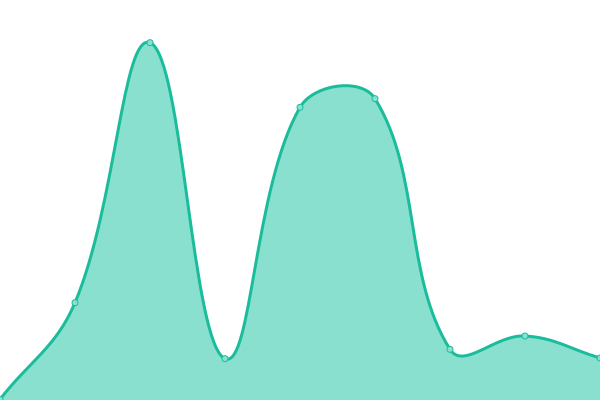
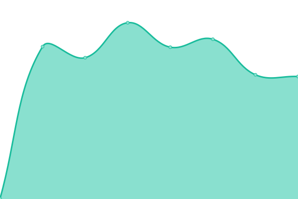
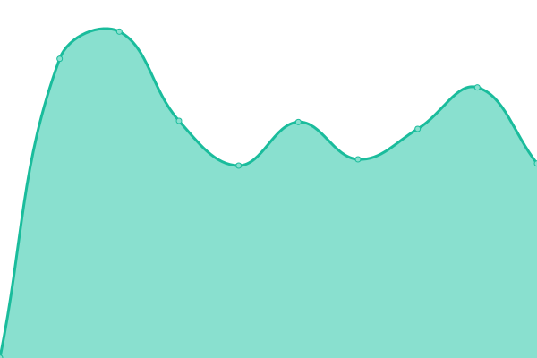
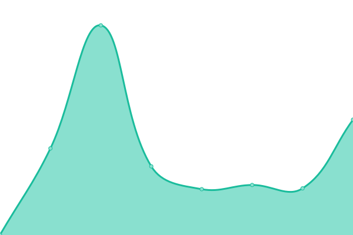
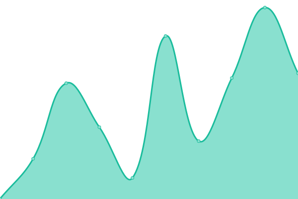
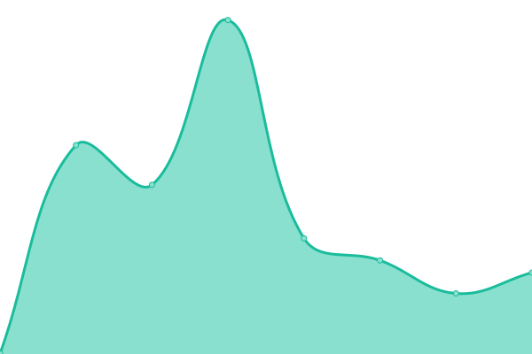

# [📈 Live Status](https://Monakoweb.github.io/upptime_ce): <!--live status--> **🟧 Partial outage**

This repository contains the open-source uptime monitor and status page for [Monakoweb](https://Monakoweb.github.io/upptime_ce), powered by [Upptime](https://github.com/upptime/upptime).

With [Upptime](https://upptime.js.org), you can get your own unlimited and free uptime monitor and status page, powered entirely by a GitHub repository. We use [Issues](https://github.com/Monakoweb/upptime_ce/issues) as incident reports, [Actions](https://github.com/Monakoweb/upptime_ce/actions) as uptime monitors, and [Pages](https://Monakoweb.github.io/upptime_ce) for the status page.

<!--start: status pages-->
<!-- This summary is generated by Upptime (https://github.com/upptime/upptime) -->
<!-- Do not edit this manually, your changes will be overwritten -->
<!-- prettier-ignore -->
| URL | Status | History | Response Time | Uptime |
| --- | ------ | ------- | ------------- | ------ |
|  [SAMAI](https://relatoria.consejodeestado.gov.co:8080/) | 🟩 Up | [samai.yml](https://github.com/Monakoweb/upptime_ce/commits/HEAD/history/samai.yml) | 

 1329ms
     
 | 

<a href="https://Monakoweb.github.io/upptime_ce/history/samai">100.00%</a>
    

|  [SAMAI AZURE](https://samai.azurewebsites.net/) | 🟩 Up | [samai-azure.yml](https://github.com/Monakoweb/upptime_ce/commits/HEAD/history/samai-azure.yml) | 

 348ms
     
 | 

<a href="https://Monakoweb.github.io/upptime_ce/history/samai-azure">100.00%</a>
    

|  [Indice Electronico](https://iedoc.consejodeestado.gov.co:448/) | 🟥 Down | [indice-electronico.yml](https://github.com/Monakoweb/upptime_ce/commits/HEAD/history/indice-electronico.yml) | 

 711ms
     
 | 

<a href="https://Monakoweb.github.io/upptime_ce/history/indice-electronico">0.00%</a>
    

|  [Vocabulario Controlado](http://190.217.24.78:8888/tematres3/vocab/index.php) | 🟥 Down | [vocabulario-controlado.yml](https://github.com/Monakoweb/upptime_ce/commits/HEAD/history/vocabulario-controlado.yml) | 

 0ms
     
 | 

<a href="https://Monakoweb.github.io/upptime_ce/history/vocabulario-controlado">0.00%</a>
    

|  [Buscador Tradicional CONSEJO](http://190.217.24.55:8080/WebRelatoria/ce/index.xhtml) | 🟩 Up | [buscador-tradicional-consejo.yml](https://github.com/Monakoweb/upptime_ce/commits/HEAD/history/buscador-tradicional-consejo.yml) | 

 854ms
     
 | 

<a href="https://Monakoweb.github.io/upptime_ce/history/buscador-tradicional-consejo">100.00%</a>
    

|  [JCA CONSEJO](https://relatoria.consejodeestado.gov.co:8088/) | 🟥 Down | [jca-consejo.yml](https://github.com/Monakoweb/upptime_ce/commits/HEAD/history/jca-consejo.yml) | 

 0ms
     
 | 

<a href="https://Monakoweb.github.io/upptime_ce/history/jca-consejo">0.00%</a>
    

|  [Ventanilla Azure](ventanillavirtual.consejodeestado.gov.co) | 🟩 Up | [ventanilla-azure.yml](https://github.com/Monakoweb/upptime_ce/commits/HEAD/history/ventanilla-azure.yml) | 

 656ms
     
 | 

<a href="https://Monakoweb.github.io/upptime_ce/history/ventanilla-azure">100.00%</a>
    

|  [SAMAI AZURE-2](samai.consejodeestado.gov.co) | 🟩 Up | [samai-azure-2.yml](https://github.com/Monakoweb/upptime_ce/commits/HEAD/history/samai-azure-2.yml) | 

 485ms
     
 | 

<a href="https://Monakoweb.github.io/upptime_ce/history/samai-azure-2">100.00%</a>
    

|  [SAMAI JCA AZURE-2](samaijca.consejodeestado.gov.co) | 🟩 Up | [samai-jca-azure-2.yml](https://github.com/Monakoweb/upptime_ce/commits/HEAD/history/samai-jca-azure-2.yml) | 

 713ms
     
 | 

<a href="https://Monakoweb.github.io/upptime_ce/history/samai-jca-azure-2">100.00%</a>
    

|  [INDICE MICRO](https://iedoc.consejodeestado.gov.co:448/swagger.html) | 🟥 Down | [indice-micro.yml](https://github.com/Monakoweb/upptime_ce/commits/HEAD/history/indice-micro.yml) | 

 455ms
     
 | 

<a href="https://Monakoweb.github.io/upptime_ce/history/indice-micro">0.00%</a>
    

<!--end: status pages-->

[**Visit our status website →**](https://Monakoweb.github.io/upptime_ce)

## 📄 License

- Powered by: [Upptime](https://github.com/upptime/upptime)
- Code: [MIT](./LICENSE) © [Monakoweb](https://Monakoweb.github.io/upptime_ce)
- Data in the `./history` directory: [Open Database License](https://opendatacommons.org/licenses/odbl/1-0/)
