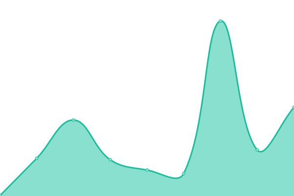

# [📈 Live Status](https://Monakoweb.github.io/upptime_ce): <!--live status--> **🟧 Partial outage**

This repository contains the open-source uptime monitor and status page for [Monakoweb](https://Monakoweb.github.io/upptime_ce), powered by [Upptime](https://github.com/upptime/upptime).

With [Upptime](https://upptime.js.org), you can get your own unlimited and free uptime monitor and status page, powered entirely by a GitHub repository. We use [Issues](https://github.com/Monakoweb/upptime_ce/issues) as incident reports, [Actions](https://github.com/Monakoweb/upptime_ce/actions) as uptime monitors, and [Pages](https://Monakoweb.github.io/upptime_ce) for the status page.

<!--start: status pages-->
<!-- This summary is generated by Upptime (https://github.com/upptime/upptime) -->
<!-- Do not edit this manually, your changes will be overwritten -->
<!-- prettier-ignore -->
| URL | Status | History | Response Time | Uptime |
| --- | ------ | ------- | ------------- | ------ |
|  [Consejo de Estado](https://consejodeestado.gov.co/) | 🟩 Up | [consejo-de-estado.yml](https://github.com/Monakoweb/upptime_ce/commits/HEAD/history/consejo-de-estado.yml) | 

 2192ms
     
 | 

<a href="https://Monakoweb.github.io/upptime_ce/history/consejo-de-estado">96.87%</a>
    

|  [SAMAI](https://relatoria.consejodeestado.gov.co:8080/) | 🟩 Up | [samai.yml](https://github.com/Monakoweb/upptime_ce/commits/HEAD/history/samai.yml) | 

 1141ms
     
 | 

<a href="https://Monakoweb.github.io/upptime_ce/history/samai">94.34%</a>
    

|  [SAMAIRJ](https://samairj.consejodeestado.gov.co/) | 🟩 Up | [samairj.yml](https://github.com/Monakoweb/upptime_ce/commits/HEAD/history/samairj.yml) | 

 1121ms
     
 | 

<a href="https://Monakoweb.github.io/upptime_ce/history/samairj">100.00%</a>
    

|  [SAMAI AZURE](https://samai.azurewebsites.net/) | 🟩 Up | [samai-azure.yml](https://github.com/Monakoweb/upptime_ce/commits/HEAD/history/samai-azure.yml) | 

 269ms
     
 | 

<a href="https://Monakoweb.github.io/upptime_ce/history/samai-azure">100.00%</a>
    

|  [Indice Electronico](https://iedoc.consejodeestado.gov.co:448/) | 🟩 Up | [indice-electronico.yml](https://github.com/Monakoweb/upptime_ce/commits/HEAD/history/indice-electronico.yml) | 

 948ms
     
 | 

<a href="https://Monakoweb.github.io/upptime_ce/history/indice-electronico">94.34%</a>
    

|  [Vocabulario Controlado](http://190.217.24.78:8888/tematres3/vocab/index.php) | 🟩 Up | [vocabulario-controlado.yml](https://github.com/Monakoweb/upptime_ce/commits/HEAD/history/vocabulario-controlado.yml) | 

 948ms
     
 | 

<a href="https://Monakoweb.github.io/upptime_ce/history/vocabulario-controlado">100.00%</a>
    

|  [Buscador Tradicional CONSEJO](http://190.217.24.55:8080/WebRelatoria/ce/index.xhtml) | 🟩 Up | [buscador-tradicional-consejo.yml](https://github.com/Monakoweb/upptime_ce/commits/HEAD/history/buscador-tradicional-consejo.yml) | 

 1318ms
     
 | 

<a href="https://Monakoweb.github.io/upptime_ce/history/buscador-tradicional-consejo">84.20%</a>
    

|  [JCA CONSEJO](https://relatoria.consejodeestado.gov.co:8088/) | 🟩 Up | [jca-consejo.yml](https://github.com/Monakoweb/upptime_ce/commits/HEAD/history/jca-consejo.yml) | 

 2100ms
     
 | 

<a href="https://Monakoweb.github.io/upptime_ce/history/jca-consejo">94.35%</a>
    

|  [SIGOBIUOS](https://sigobius.consejodeestado.gov.co/SIGOBIUS/wsCorrespondencia/srvCorrespondencia.asmx?wsdl) | 🟩 Up | [sigobiuos.yml](https://github.com/Monakoweb/upptime_ce/commits/HEAD/history/sigobiuos.yml) | 

 1603ms
     
 | 

<a href="https://Monakoweb.github.io/upptime_ce/history/sigobiuos">99.62%</a>
    

|  [Linkce](https://linkce.consejodeestado.gov.co/) | 🟥 Down | [linkce.yml](https://github.com/Monakoweb/upptime_ce/commits/HEAD/history/linkce.yml) | 

 0ms
     
 | 

<a href="https://Monakoweb.github.io/upptime_ce/history/linkce">0.00%</a>
    

<!--end: status pages-->

[**Visit our status website →**](https://Monakoweb.github.io/upptime_ce)

## 📄 License

- Powered by: [Upptime](https://github.com/upptime/upptime)
- Code: [MIT](./LICENSE) © [Monakoweb](https://Monakoweb.github.io/upptime_ce)
- Data in the `./history` directory: [Open Database License](https://opendatacommons.org/licenses/odbl/1-0/)
